##页面标记

对页面主题和内容的性质进行标记的引用

###源码

####html

	

	    default
	    primary
	    secondary
	    success
	    info
	    warning
	    danger
	    

	    在线支付
	    随订随用
	    有效期内可退
	

###效果示例

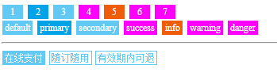

##按钮

页面中使用的所有按钮样式

###源码

####html

	

	    <button class="blend-button">default</button>
	    <button class="blend-button blend-button-primary">primary</button>
	    <button class="blend-button blend-button-secondary">secondary</button>
	    <button class="blend-button blend-button-success">success</button>
	    <button class="blend-button blend-button-info">info</button>
	    <button class="blend-button blend-button-warning">warning</button>
	    <button class="blend-button blend-button-danger">danger</button>
	     
	    <a href="http://www.baidu.com" class="blend-button">在线支付</a>
	    <a href="http://www.baidu.com" class="blend-button blend-button-primary">购买</a>
	    <a href="http://www.baidu.com" class="blend-button blend-button-secondary">购买</a>
	    <a href="http://www.baidu.com" class="blend-button blend-button-success">购买</a>
	    <a href="http://www.baidu.com" class="blend-button blend-button-info">购买</a>
	    <a href="http://www.baidu.com" class="blend-button blend-button-warning">购买</a>
	    <a href="http://www.baidu.com" class="blend-button blend-button-danger">购买</a>
	    <a href="http://www.baidu.com" class="blend-button blend-button-link">购买</a>
	    <a href="http://www.baidu.com">购买</a>
	

###效果示例

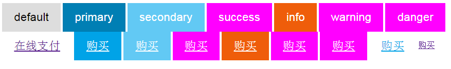

##选择框

页面中的选择框

###源码

####html

	    

	          
	        
	        
	        
	          
	
	    

	
	    

	          
	        
	        
	    

	
	     

	          
	        
	        
	    

	  
	    <button id="getData1" >获取第一组值</button>
	    <button id="getData2" >获取第二组值</button>
	    <button id="getData3" >获取第三组值</button>
	     
	    <textarea id="rs"></textarea>

####Javascript

    

###效果示例

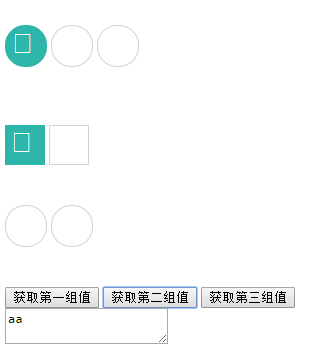

##计数器

计数器，用作数量的加减

###源码

####html

    

        
-

        <input class="blend-counter-input" type="text">
        
+

    

    

        
-

        <input class="blend-counter-input" type="text">
        
+

    

####Javascript

	

###效果示例

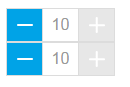

##对话框

用作提示的对话框

###源码

####html

	<button onclick="dialog2.show()">两个按钮dialog</button>
	      
	<button onclick="dialog1.show()">一个按钮dialog</button>
	
    

         
 标题 

      	 
 内容 

      	 

         	<a href="javascript:void(0);" class="blend-dialog-cancel">取消</a>
        	<a href="javascript:void(0);" class="blend-dialog-done">确认</a>
      	 

     

    

####Javascript

    

###效果示例

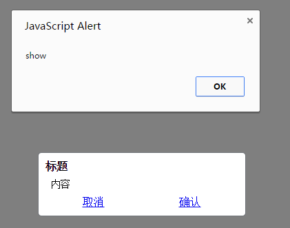

##固定页眉页脚

可拉长的页眉页脚

###源码

####html

	

		我是头部固定人
    

    

		我是尾部固定人
    

####Javascript

    

###效果示例

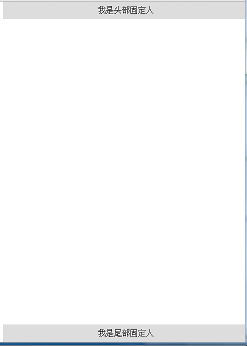

##图片集

可以滑动展示的图片集

###源码

####html

	

    

        
    

    <button id="show" class="show">click to show</button>
    <button id="show1" class="show">click to show1</button>

####Javascript

    

###效果示例

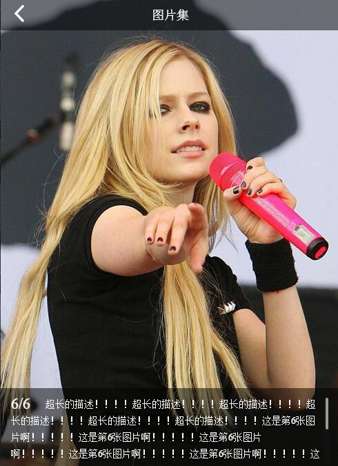

##页头

页头的样式

###源码

####html

    <header data-blend-widget="header" class="blend-header">
        
            <a class="blend-header-item blend-action-back" href="javascript:history.back();">返回</a>
        
        
            第二个页面
        
        
            <a class="blend-header-item" href="http://www.google.com">Google</a>
            <a class="blend-header-item blend-button blend-button-info" href="header.test.html">测试1</a>
        
    </header>

    <a class="blend-header-item blend-button blend-button-info" href="header.test.html">测试1</a>

####Javascript

    

###效果示例

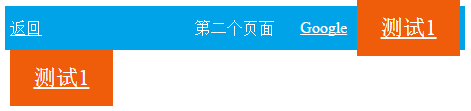

##列表

页面中用来展示数据的列表

###源码

####html

    <section data-blend-widget="list" class="blend-list">
        

            
123

            删除
        

        

            
1323423

            删除
        

        

            
12432343

            删除
        

    </section>

    <button id="revert">revert</button> 
    <button id="add">add</button> 
    <button id="refresh">refresh</button> 
    <button id="destroy">destroy</button> 
    <button id="create">create</button> 

####Javascript

    

###效果示例

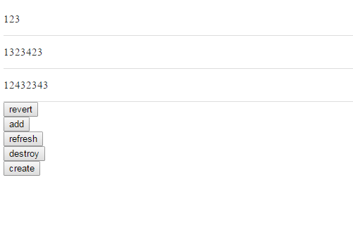

##加载界面

加载内容过程中的等待界面

###源码

####html

    <button onclick="triggerLoading()">打开loading</button>
      
    <button onclick="closeLoading()">关闭loading</button>
    
loading

####Javascript

    

###效果示例

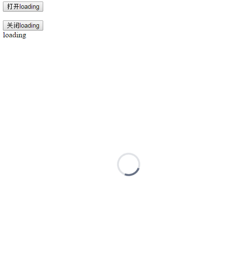

##对话框

用作提示的对话框

###源码

####html

	<button onclick="dialog2.show()">两个按钮dialog</button>
	      
	<button onclick="dialog1.show()">一个按钮dialog</button>
	
    

         
 标题 

      	 
 内容 

      	 

         	<a href="javascript:void(0);" class="blend-dialog-cancel">取消</a>
        	<a href="javascript:void(0);" class="blend-dialog-done">确认</a>
      	 

     

    

####Javascript

    

###效果示例

##内容面板

展示内容的面板

###源码

####html

	

		

			长途汽车:
		

		

			成都新南门车站——峨眉山客运中心（峨眉山市票价43元/人），30分钟一班。
			旅游专线：乐山客运中心站——峨眉山市乐山港——峨眉山报国寺乐山客运中心站——沙湾乐山港
			 【有效期】 2015.03.15
			 【退票规则】 使用前均可提前退票
		

		

			加载更多
		

	

###效果示例

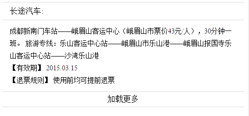

##图片样式

不同的图片展示样式

###源码

####html

    <figure data-widget="picture" class="blend-picture blend-picture-default blend-picture-radius" data-picture="{}">
       
       <figcaption class="blend-picture-title blend-picture-title-default">bottom,带链接，default图片</figcaption>
    </figure>
    <figure data-widget="picture" class="blend-picture blend-picture-full " data-picture="{}">
        
       <figcaption class="blend-picture-title blend-picture-title-default">bottom,不带链接，full图片</figcaption>
    </figure>
    <figure data-widget="picture" class="blend-picture blend-picture-full" data-picture="{}">
        
       <figcaption class="blend-picture-title blend-picture-title-cover">黑底，不带链接，full图片</figcaption>
    </figure>
    <figure data-widget="blend-picture" class="blend-picture blend-picture-default" data-picture="{}">
        
        <figcaption class="blend-picture-title blend-picture-title-cover">黑底，不带链接，default图片</figcaption>
    </figure>

###效果示例

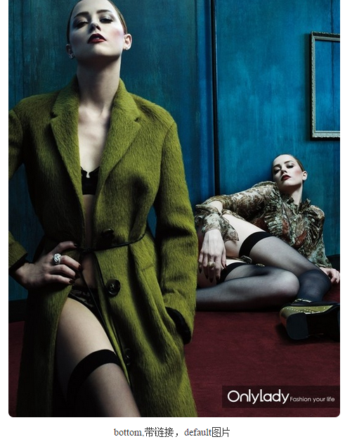
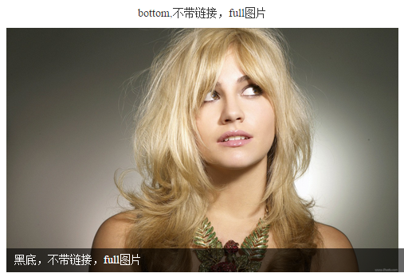
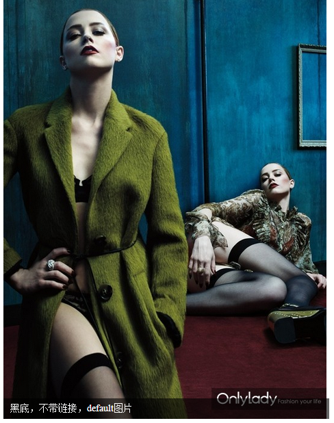

##滑动图片展示框

用作展示图片的滑动窗口

###源码

####html

    

        <ul class="blend-slides">
            <li>
        	    
                
这是图片1的标题

        	</li>
            <li>
                
                
这是图片2的标题

            </li>
            <li>
                
                
这是图片3的标题
  
            </li>
            <li>
                
                
这是图片4的标题
   
            </li>
         
        </ul>
  

  <button id="prev">上一张</button>

  <button id="paused">暂停</button>

  <button id="next">下一张</button>

####Javascript

    

###效果示例

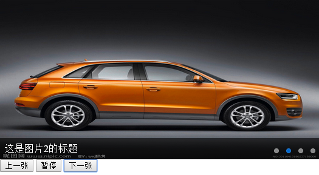

##标签

切换容器内容的标签

###源码

####html

    <section class="blend-tab">
        

            
我的

            
你的

            

        

        

            
我的

            
你的

        

    </section>

    <button id="active">active</button> 
    <button id="destroy">destroy</button> 
    <button id="create">create</button> 

####Javascript

    

###效果示例

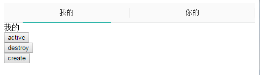

##导航标签

页面导航位置上，可以切换内容的标签

###源码

####html

    <nav data-blend-widget="tabnav" class="blend-tabnav blend-tabnav-dash" style="margin-bottom: 20px;">

        <a class="blend-tabnav-item blend-tabnav-item-active" href="#">
            NIHAO
        </a>
        <a class="blend-tabnav-item" href="#">
            GEREN
        </a>

    </nav>

    <nav data-blend-widget="tabnav" class="blend-tabnav">

        <a class="blend-tabnav-item blend-tabnav-item-active" href="#">
            NIHAO
        </a>
        <a class="blend-tabnav-item" href="#">
            GEREN
        </a>
        <a class="blend-tabnav-item" href="#">
            NIHAO
        </a>
        <a class="blend-tabnav-item" href="#">
            GEREN
        </a>

    </nav>

###效果示例

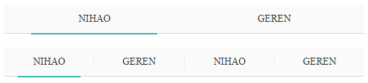

##闪现的提示内容

在页面上淡出的提示内容

###源码

####html

	


	<button onclick="triggerToast()">点我，点我</button>

####Javascript

    

###效果示例

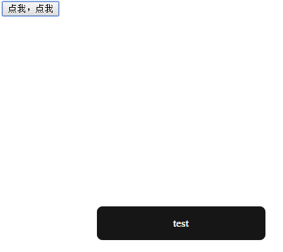